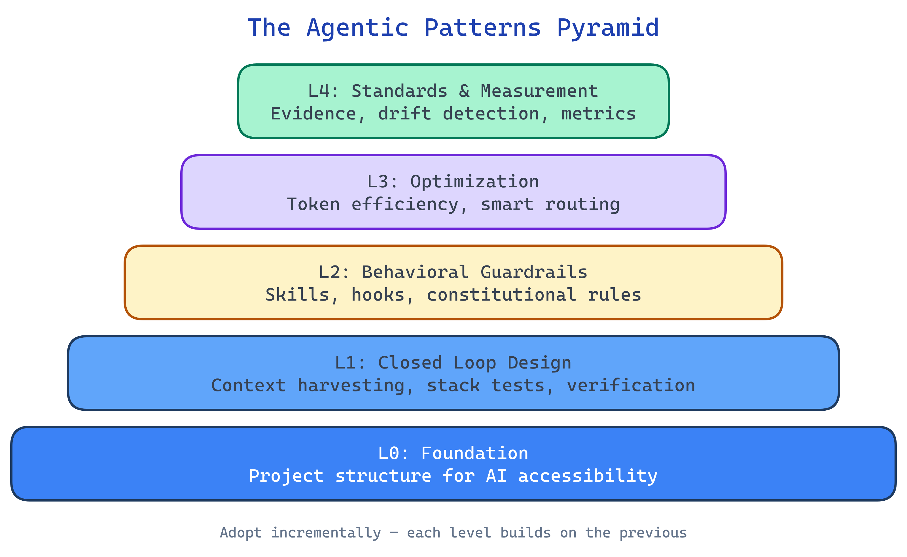

# Agentic Patterns

A toolkit of patterns for making codebases work effectively with AI coding agents — gathered from production use, organized by increasing capability, and designed to adopt incrementally.

## Why This Exists

AI coding agents are becoming standard tools. But most codebases were built for humans — humans who can mentally bridge gaps, tolerate partial feedback, rely on intuition to navigate messy directories, and instinctively know which warnings to ignore.

AI agents can't do any of that. They need:

- **Complete feedback** — a test either passes or fails, and the failure tells them exactly where to look
- **Structured context** — information organized so complexity is discoverable, not dumped all at once
- **Enforced discipline** — rules that are impossible to bypass, not just written in a wiki
- **Deterministic environments** — no "it works on my machine," no shared state leaking between tests

None of these ideas are new. Deep modules, progressive disclosure, and evidence-based engineering are decades old — drawn from John Ousterhout's work on software design, Matt Pocock's graybox module concept, and well-established testing discipline. What's new is how critical they become when your coworker is an AI with no memory of your codebase and no intuition to fall back on.

These patterns stand on the shoulders of those established ideas. They reframe practices that excellent engineers already use — making them explicit, composable, and enforceable so that agents and humans alike benefit from the structure.

## Where These Patterns Come From

The patterns were extracted from a [production-grade Telegram trading bot](docs/references/reference-telegram-trading-bot-case-study.md) — a financial application handling real blockchain transactions, built fully agentically with Claude Code as the primary development tool. That project developed **Stack-First Development**: bringing up the entire application stack in Docker and testing through API endpoints only, where each stack test is an atomic user journey that passes or fails as a whole.

Peter Steinberger, creator of OpenClaw, has described a similar approach — managing 5-10 parallel agents, closing the feedback loop so agents verify their own work, investing heavily in planning before implementation, and treating code reviews as architecture discussions. His core insight: *"I don't think software engineering is dead with AI: in fact, quite the opposite."* Agentic development demands more engineering discipline, not less.

Other frameworks approach similar problems from different angles. [gstack](https://github.com/garrytan/gstack) provides a skill framework with resolver pipelines. [superpowers](https://github.com/obra/superpowers) provides base skills for brainstorming, planning, TDD, and code review. [rig](https://github.com/franklywatson/claude-rig) implements the L2-L3 patterns from this repo as a working agent harness with enforcement pipelines, tool routing, and session management. These systems informed this work — the best available ideas at the time, applied and refined in production.

The lineage: patterns were extracted from the reference project, organized into this library, then used to build rig — which now serves as both a reference implementation and a development tool for improving this very repo.

### Reference Implementations

| System | What it implements | Language |
|--------|-------------------|----------|
| [rig](https://github.com/franklywatson/claude-rig) | L2 enforcement pipeline, L3 tool routing + scout agent, skill chain with phase transitions, CLI installer, CI guardrails | TypeScript |
| [gstack](https://github.com/garrytan/gstack) | L2 skill framework with resolver pipeline, preamble system | TypeScript |
| [superpowers](https://github.com/obra/superpowers) | L2 base skills (brainstorming, TDD, verification, review), automated worktree management | Markdown/JS |

## The Pattern Pyramid

Patterns are organized into five levels, each building on the previous. The levels suggest an adoption order — earlier levels provide the foundation that later levels depend on — but teams should start where their gaps are and adopt what helps.



### Level Overviews

**[L0: Foundation](docs/L0-foundation.md)** — Structure your codebase so an AI with zero prior context can navigate, understand, and contribute. Deep modules, progressive disclosure, conceptual file organization, CLAUDE.md as project constitution, unit tests as contract, documentation as system map, and aggressive cleanup. The "can a new starter figure this out?" test.

**[L1: Closed Loop Design and Verification](docs/L1-feedback-loops.md)** — The level where agents stop guessing and start designing. Context harvesting gathers targeted evidence before implementation. Stack tests validate design intent end-to-end through the full application stack — no mocks, no partial integration, no ambiguous results. Full-loop assertion layering catches regressions at primary, secondary, and tertiary levels.

**[L2: Behavioral Guardrails](docs/L2-behavioral-guardrails.md)** — Rules written in prose are suggestions. Skills and hooks are enforcement. Overlay skills on top of base agent capabilities, chain them into a complete development lifecycle, and automate discipline through the tool layer.

**[L3: Optimization](docs/L3-optimization.md)** — Agent efficiency is quality, not just speed. Smart routing redirects shell commands to specialized tools (60-80% token reduction). Intent classification, environment-aware routing, and the Scout Pattern (from the WISC context engineering framework: Write, Isolate, Select, Compress) turn exploration into structured context.

**[L4: Standards & Measurement](docs/L4-standards-measurement.md)** — Evidence-based claims, spec drift detection, the new starter audit, and development metrics. The maturity layer that verifies L0-L3 are holding and measures their impact over time.

## Getting Started

1. **New to agentic development?** Start with [L0: Foundation](docs/L0-foundation.md). The structural changes there are the highest-impact, lowest-effort starting point.
2. **Already using AI coding tools?** Jump to [L1: Closed Loop Design and Verification](docs/L1-feedback-loops.md) to understand how context harvesting and closed-loop verification improve agent outcomes.
3. **Building team practices?** [L2: Behavioral Guardrails](docs/L2-behavioral-guardrails.md) and [L4: Standards & Measurement](docs/L4-standards-measurement.md) together establish the discipline layer.
4. **Looking for adoption paths?** See the [Adoption Guide](docs/cross-cutting/adoption-guide.md) for suggested approaches — not a rigid plan, but a set of paths teams have found useful.

## Audience

- **Solo developers and small teams** using Claude Code, Cursor, or similar tools — adopt patterns incrementally starting at L0
- **Team leads and architects** exploring agentic development practices for their organization
- **Anyone** curious about what "agentic-friendly" software engineering looks like in practice

## What's in This Repo

```
docs/               # Pattern documentation (L0-L4) and guides
examples/           # Working code examples (TypeScript + Python)
  stack-test/
    typescript/     # Jest-based stack tests + Playwright browser tests
                    #   Demonstrates: API-level AND browser-driven verification
                    #   Stack: Node.js + PostgreSQL + Redis in Docker
    python/         # pytest-based stack tests (API-level only)
                    #   Demonstrates: API-level verification, Python conventions
                    #   Stack: Python + PostgreSQL + Redis in Docker
  guardrails/       # L3 token optimization middleware (TypeScript)
                    #   Intent classification, smart routing, environment detection
  project-structure/ # Before/after directory layouts
docs/cross-cutting/ # Anti-patterns, adoption guide, FAQ, glossary
docs/references/    # Case study and further reading
```

The TypeScript and Python stack-test examples cover the same core pattern (Docker-based stack tests with full-loop assertions) but differ in scope: the TypeScript example extends to browser-based testing with Playwright, while the Python example demonstrates API-level testing with pytest conventions. Both are self-contained and runnable independently.

## Contributing

This is a living pattern library. Contributions welcome:

- **New patterns** that extend or challenge the existing framework
- **Real-world examples** from different domains (the current examples lean toward ecommerce and trading)
- **Corrections** when a pattern doesn't match your experience — document the exception
- **Translations** of concepts to other frameworks and tools

## Background and Further Reading

- [Reference Telegram Trading Bot Case Study](docs/references/reference-telegram-trading-bot-case-study.md) — the production system these patterns were extracted from
- [FAQ](docs/cross-cutting/faq.md) — deployment, operations, and other SDLC concerns beyond the patterns
- [Further Reading](docs/references/further-reading.md) — articles, videos, and tools that informed this work
- [Glossary](docs/cross-cutting/glossary.md) — terminology reference
