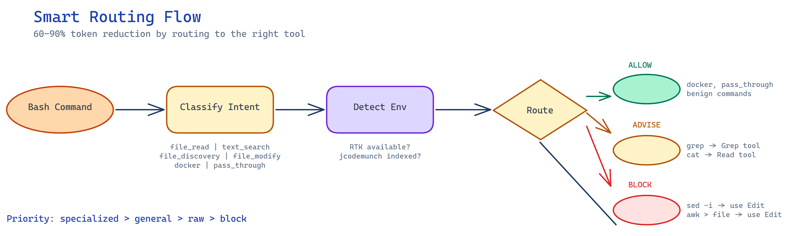

# L3 Optimization — Token Efficiency & Agent Performance

**Level**: Optimization (L3)
**Prerequisites**: [L2 Guardrails](./L2-guardrails.md)
**Related Patterns**: Scout Pattern

---

## Overview

L3 Optimization focuses on making agents more efficient by routing commands to the right tools, classifying intent before execution, and investing tokens upfront in structured exploration. These patterns reduce token consumption by 60-90% while improving outcome quality.

The core insight: **not all tool calls are created equal**. A raw `grep` returns 200 lines of noisy text; a structured search returns 5 typed results with summaries. Blind file exploration wastes tokens bouncing between false leads; structured scoping produces a map before the journey.

---

## Pattern 3.1 — Smart Routing / Tool Selection



### Problem

Agents often use inefficient tools for common operations. A raw bash `grep` across a codebase returns megabytes of unstructured text. The agent then wastes tokens parsing line numbers, extracting context, and filtering noise.

### Solution

Route commands to the most efficient tool based on intent detection. Maintain a routing table that maps common commands to their optimal implementations.

| Command | Preferred Tool | Why | Token Savings |
|---------|---------------|-----|---------------|
| `grep`/`rg` | Grep tool or jcodemunch | Structured, targeted results | ~80% |
| `cat` | Read tool | Clean output, no artifacts | ~75% |
| `find` | Glob or jcodemunch | Targeted discovery | ~77% |
| `sed -i` / `awk` | Edit tool (always) | Destructive, should block | Prevents errors |
| `git status` | RTK (if available) | Filtered output | ~60% |
| `npm install` | RTK (if available) | Silent execution | ~40% |
| code search | jcodemunch `search_symbols` | Typed results with summaries | ~85% |

### In Practice

```typescript
// Routing table entry for grep
{
  command: /grep|rg/,
  intents: ['text_search'],
  resolutions: {
    rtk: { action: 'advise', tool: 'rtk grep', reason: 'structured output' },
    jcodemunch: { action: 'advise', tool: 'search_text', reason: 'indexed search' },
    fallback: { action: 'advise', tool: 'Grep', reason: 'dedicated tool' }
  }
}
```

When the agent attempts `grep -r "function" src/`, the middleware:
1. Detects the `grep` intent
2. Checks available tools (RTK? jcodemunch?)
3. Returns an `advise` resolution pointing to the best tool
4. Agent re-routes the call automatically

### Anti-Pattern

```bash
# DON'T: Let agent grep the entire codebase
grep -r "export.*function" . | head -100

# DO: Use structured search
search_symbols(query="export.*function", kind="function")
```

Raw grep returns line noise. Structured search returns typed symbols with file locations and summaries — same information, fraction of the tokens.

### Cross-References

- [Pattern 3.2](#pattern-32--intent-classification) — Detecting intent from commands
- [Pattern 3.3](#pattern-33--environment-aware-routing) — Checking available tools
- [L2 Guardrails](./L2-guardrails.md) — Enforcing routing decisions

---

## Pattern 3.2 — Intent Classification

### Problem

Bash commands are opaque strings. An agent's `grep -r pattern .` could be a search, but `sed -i 's/old/new/g' file` is a mutation. Without parsing the command, we can't route it correctly or block dangerous operations.

### Solution

Parse bash commands into intent categories. Classify each segment of compound commands independently. Check destructive patterns first (precedence matters).

| Intent | Description | Examples | Default Resolution |
|--------|-------------|----------|-------------------|
| `file_read` | Reading file contents | `cat file.txt`, `head file` | Advise Read tool |
| `text_search` | Searching text content | `grep pattern`, `rg pattern` | Advise Grep/jcodemunch |
| `file_discovery` | Finding files by name/pattern | `find . -name "*.ts"`, `fd pattern` | Advise Glob/jcodemunch |
| `file_modify` | Destructive file edits | `sed -i`, `awk ... > file` | **BLOCK** (use Edit) |
| `docker` | Container operations | `docker build`, `docker-compose up` | Allow (pass-through) |
| `pass_through` | Unknown/benign commands | `ls`, `pwd`, `echo` | Allow (pass-through) |

### In Practice

```typescript
// Intent patterns ordered by precedence
const INTENT_PATTERNS: IntentMatch[] = [
  { pattern: /^\s*sed\s+(-i|--in-place)\b/, type: 'file_modify' },
  { pattern: /^\s*awk\b.*>\s*\S+/, type: 'file_modify' },
  { pattern: /^\s*cat\s+\S+/, type: 'file_read' },
  { pattern: /^\s*(grep[rx]?|rg)\b/, type: 'text_search' },
  { pattern: /^\s*find\s+/, type: 'file_discovery' },
  { pattern: /^\s*fd\b/, type: 'file_discovery' },
  { pattern: /^\s*docker(-compose)?\b/, type: 'docker' },
];

// Split compound commands
function classifyCommand(command: string): Intent[] {
  const segments = command.split(/&&|\|\||;|\|/);
  return segments.flatMap(segment => {
    for (const { pattern, type } of INTENT_PATTERNS) {
      if (pattern.test(segment.trim())) return [type];
    }
    return ['pass_through'];
  });
}
```

Precedence is critical: `sed -i` must match before generic text patterns, else it gets classified as `text_search` and allowed through.

### Anti-Pattern

```typescript
// DON'T: Check for generic patterns first
if (/grep|sed|awk/.test(cmd)) return 'text_search';
// sed -i slips through!

// DO: Check destructive patterns first
if (/sed\s+(-i|--in-place)/.test(cmd)) return 'file_modify';
if (/grep/.test(cmd)) return 'text_search';
```

### Cross-References

- [Pattern 3.1](#pattern-31--smart-routing--tool-selection) — Mapping intents to tools
- [Example Implementation](../examples/guardrails/src/core/intent.ts) — Full intent classifier

---

## Pattern 3.3 — Environment-Aware Routing

### Problem

Optimal tools vary by environment. A project indexed by jcodemunch should use `search_symbols`. A machine with RTK installed should use `rtk grep`. Hard-coding a single tool breaks portability.

### Solution

Detect available tools at session start and cache results. Route commands based on what's actually available. Gracefully degrade when specialized tools are missing.

**Detection Checklist:**
- **RTK**: Run `which rtk` and check exit code
- **jcodemunch**: Check for `.jcodemunch/` directory in project root
- **Stack test context**: Check `./test-logs/` for files modified within 5 minutes
- **Cache**: Store detection results for 30 minutes

**Priority Resolution:**
1. Specialized tool (RTK/jcodemunch) → use it
2. General tool (Grep/Read/Glob) → next best
3. Raw command → allow, but log missed optimization
4. Block → only for dangerous operations

### In Practice

```typescript
interface Environment {
  rtkAvailable: boolean;
  jcodemunchIndexed: boolean;
  stackTestActive: boolean;
  detectedAt: number;  // timestamp
}

async function detectEnvironment(projectDir: string): Promise<Environment> {
  const [rtkCheck, jmCheck, stackCheck] = await Promise.all([
    exec('which rtk').then(() => true).catch(() => false),
    access(`${projectDir}/.jcodemunch`).then(() => true).catch(() => false),
    checkStackTestActive(projectDir)
  ]);

  return {
    rtkAvailable: rtkCheck,
    jcodemunchIndexed: jmCheck,
    stackTestActive: stackCheck,
    detectedAt: Date.now()
  };
}

// Resolution with environment awareness
function resolve(rule: RoutingRule, env: Environment): Resolution {
  if (env.rtkAvailable && rule.resolutions.rtk) {
    return rule.resolutions.rtk;
  }
  if (env.jcodemunchIndexed && rule.resolutions.jcodemunch) {
    return rule.resolutions.jcodemunch;
  }
  return rule.resolutions.fallback ?? rule.resolutions._;
}
```

### Anti-Pattern

```typescript
// DON'T: Assume tools are present
function routeGrep() {
  return 'rtk grep';  // fails if rtk not installed
}

// DO: Check and degrade gracefully
function routeGrep(env: Environment) {
  if (env.rtkAvailable) return 'rtk grep';
  return { action: 'allow' };  // let raw grep through
}
```

### Cross-References

- [Pattern 3.1](#pattern-31--smart-routing--tool-selection) — Routing table format
- [Example Implementation](../examples/guardrails/src/core/environment.ts) — Full detector

---

## Pattern 3.4 — Context Engineering — The Scout Pattern


### Problem

Agents often "search blindly" — issuing `grep` and `find` commands without understanding the codebase structure. This leads to false positives, wasted context, and missed files. Each blind search is a token tax.

### Solution

From the **WISC framework** (Cole Medin, adapted by DIY Smart Code): **invest tokens upfront in structured exploration**. WISC — **W**rite, **I**solate, **S**elect, **C**ompress — is a context engineering framework based on the observation that ~80% of agent failures come from how you manage context, not from the model itself. The Scout Pattern maps to the **Isolate** strategy: keep exploration noise out of the main session by delegating to sub-agents.

Send a lightweight "scout" agent to map the codebase first:

1. **File tree**: Get directory structure and key files
2. **Key exports**: Identify main entry points and exported symbols
3. **Dependencies**: Map imports and module relationships
4. **Summarize**: Return a concise map, not raw dumps

The implementer agent then acts with full context, making targeted decisions instead of blind searches.

### In Practice

```typescript
// Scout returns a structured map
interface CodebaseMap {
  structure: FileTree;
  entryPoints: string[];
  keyExports: SymbolSummary[];
  dependencies: DependencyGraph;
}

// Scout agent runs first
const map = await scoutAgent.analyze('/project');

// Implementer uses the map
const targetFile = map.keyExports.find(s => s.name === 'processPayment')?.file;
await editFile(targetFile, { replace: oldPattern, with: newPattern });
```

Structured exploration produces:
- **File tree**: 50 tokens vs 500 tokens of `find` output
- **Symbol index**: Typed results vs grep noise
- **Decision quality**: Agent knows where things are

### Anti-Pattern

```bash
# DON'T: Blind search
grep -r "processPayment" .    # 5000 tokens of noise
grep -r "payment" .           # Another 5000 tokens
find . -name "*.ts" | xargs grep "export"

# DO: Scout first
scout.mapCodebase()           # 200 tokens, returns structured index
target = map.exports.find("processPayment")  # O(1) lookup
```

### Cross-References

- [WISC Framework](https://youtu.be/gyo0eRgsUWk) — Write, Isolate, Select, Compress context engineering strategies
- [WISC GitHub repo](https://github.com/coleam00/context-engineering-intro/tree/main/use-cases/ai-coding-wisc-framework) — Full framework with examples
- [jcodemunch](https://github.com/jeromedecock/jcodemunch) — Tool for indexing codebases

---

## Pattern 3.5 — Structured Output over Raw Text

### Problem

Raw text commands (grep, find, cat) return unstructured output. Agents waste tokens parsing line numbers, extracting filenames, and filtering noise. The information is there, but buried in format overhead.

### Solution

Prefer tools that return structured, summarized results. Compare:

| Raw Command | Structured Tool | Output Format | Token Savings |
|-------------|-----------------|---------------|---------------|
| `grep -r "export"` | `search_symbols` | `{name, kind, file, summary}` | ~85% |
| `find . -name "*.ts"` | `get_file_tree` | `{path, type, exports}` | ~80% |
| `cat file.ts` | `get_symbol` | `{signature, docs, body}` | ~75% |
| `git log` | `gh repo view` | `{issues, prs, commits}` | ~70% |

Structured output lets the agent reason about data, not parse strings.

### In Practice

```typescript
// Raw grep (200 lines of noise)
$ grep -r "function.*process" ./src
src/auth.ts:45:export function processLogin() {
src/auth.ts:89:function processLogout() {
src/payment.ts:12:export async function processPayment() {
// ... 197 more lines

// Structured search (5 results)
$ search_symbols("process", kind="function")
[
  { name: "processLogin", file: "src/auth.ts", line: 45, summary: "Authenticates user" },
  { name: "processLogout", file: "src/auth.ts", line: 89, summary: "Clears session" },
  { name: "processPayment", file: "src/payment.ts", line: 12, summary: "Handles Stripe charges" }
]
```

Same information. The structured version is 5% of the tokens and immediately usable by the agent.

### Anti-Pattern

```bash
# DON'T: Parse raw text with grep
grep -r "export" . | grep "function" | cut -d: -f1 | sort -u

# DO: Query structured data
search_symbols({ kind: "function" }).map(s => s.file)
```

### Cross-References

- [Pattern 3.1](#pattern-31--smart-routing--tool-selection) — Routing to structured tools
- [jcodemunch](https://github.com/jeromedecock/jcodemunch) — Codebase indexing tool

---

## Pattern 3.6 — Cross-Domain Architecture Alignment

### Problem

Monorepos have traditionally solved a real problem: keeping architectures aligned across related services. When multiple teams own services that share contracts, protocols, or data models, a monorepo ensures a single source of truth. But monorepos extract a heavy tax: context bloat. Every agent session loads the entire repository structure, and L0 progressive disclosure breaks down when unrelated services share the same tree. A payments team's agent doesn't need the notification service's code, but in a monorepo, it's there — consuming context, creating noise, increasing the chance of false-positive search results.

### Solution

**AI agents can traverse multiple repositories to align architectures without requiring them to share a filesystem.** An agent can read the authentication service's API contract from `repo-a`, the notification service's event schema from `repo-b`, and the payment service's type definitions from `repo-c` — then analyze whether the three are architecturally consistent. This was impractical for human developers switching between repos, but agents do it naturally.

This doesn't mean monorepos are wrong. It means the cost-benefit calculation has shifted:

| Concern | Monorepo | Multi-Repo + Agentic Alignment |
|---------|----------|-------------------------------|
| Contract consistency | Enforced by shared types | Verified by agent analysis on change |
| Context bloat | High — all code visible to agent | Low — each repo loads independently |
| Build coupling | Shared build pipeline | Independent pipelines, agent checks integration |
| Discovery | File tree navigation | Agent reads CLAUDE.md + entry points per repo |
| Scope for errors | Cross-service breakage caught at build | Cross-service breakage caught by agent review |

### In Practice

**When multi-repo with agentic alignment works well:**
- Services with clearly owned domains (payments, auth, notifications)
- Teams that want independent deploy cycles
- Codebases where L0 progressive disclosure matters more than shared types
- Projects where context window usage is a bottleneck

**When a monorepo is still the better choice:**
- Services with shared internal types that change frequently
- Teams that lack the discipline to maintain separate CLAUDE.md files per repo
- Projects where build tooling assumes a monorepo (turborepo, nx)

**The agentic alignment workflow:**
1. Each repo maintains its own CLAUDE.md with API contracts and public interfaces
2. When a service changes its API, the agent reads dependent repos' CLAUDE.md files to identify breakage
3. The agent proposes coordinated changes across repos based on analysis, not assumption
4. L4 documentation freshness ensures contracts stay current in each repo

This is a **subjective trade-off, not a hard rule**. The point is that agentic development makes the multi-repo approach more viable than it was — the coordination cost that previously required a monorepo can now be handled by an agent that reads across repositories.

### Anti-Pattern

**Don't** split into multiple repos without maintaining CLAUDE.md and public interfaces in each. A multi-repo setup without L0 entry points is worse than a monorepo — the agent can't find anything.

**Don't** treat this as a mandate to break up monorepos. If your monorepo works, keep it. This pattern is for teams where the monorepo's context tax is actively causing problems.

### Cross-References

- [Pattern 0.2 — Progressive Disclosure](../L0-foundation.md#pattern-02--progressive-disclosure) — Context bloat undermines progressive disclosure
- [Pattern 0.4 — CLAUDE.md as Project Constitution](../L0-foundation.md#pattern-04-claude-md-as-project-constitution) — Each repo needs its own entry point
- [Pattern 3.4 — The Scout Pattern](#pattern-34--context-engineering--the-scout-pattern) — Structured exploration across repos

---

## Pattern 3.7 — TOON Serialization for MCP Response Optimization

### Problem

MCP (Model Context Protocol) servers return data to LLMs as JSON. For tabular responses — order lists, portfolio holdings, market data — JSON's repeating keys and structural overhead consume tokens without adding information. A list of 50 orders with 8 fields each produces a JSON payload where ~60% of the characters are structural syntax, not data. When agents consume MCP endpoints, this overhead scales linearly with every response.

### Solution

**TOON (Token-Oriented Object Notation)** is a compact, human-readable encoding of the JSON data model designed specifically for LLM prompts. It provides lossless round-trip serialization while eliminating redundant structure. For uniform object arrays — the most common shape of MCP tabular responses — TOON uses a header-plus-rows format that declares the schema once and omits field names from every row.

**JSON vs TOON for the same data:**

```json
// JSON — 163 characters
[{"id":1,"symbol":"ETH","balance":"2.5","usd":"8125.00"},{"id":2,"symbol":"USDC","balance":"1500.0","usd":"1500.00"}]
```

```toon
// TOON — 61 characters (63% reduction)
balances[2]{id,symbol,balance,usd}:
  1,ETH,2.5,8125.00
  2,USDC,1500.0,1500.00
```

The header `[2]{id,symbol,balance,usd}:` declares record count and field names once. Each row contains only values, separated by commas. Records are separated by pipes (or newlines). The savings compound with record count — 100 rows means 100 fewer repetitions of field names.

**Key TOON format rules:**
- Line-oriented, indentation-based syntax
- Array length declared explicitly: `[N]`
- Uniform object arrays use tabular format: `{field1,field2}:`
- Values separated by commas, records by pipes or newlines
- Nested objects encoded inline
- Full lossless round-trip: `decode(encode(data)) === data`

### In Practice

Apply TOON serialization as middleware on MCP response paths:

```typescript
// Middleware: detect tabular fields, apply TOON, attach metadata
class MCPResponseFormatter {
  private eligibleTools = [
    'get_positions', 'get_balances', 'get_orders',
    'get_market_data', 'get_trade_history'
  ];
  private minSavingsThreshold = 20; // percent

  formatResponse(data: unknown, toolName: string) {
    if (!this.shouldAttemptTOON(toolName, data)) {
      return { format: 'json', data };
    }

    const result = encode(data); // TOON encode
    const savings = this.calculateSavings(data, result);

    if (savings >= this.minSavingsThreshold) {
      return {
        format: 'toon',
        data: result,
        metadata: { savings, originalSize: JSON.stringify(data).length, toonSize: result.length }
      };
    }

    return { format: 'json', data };
  }

  shouldAttemptTOON(toolName: string, data: unknown): boolean {
    return this.eligibleTools.includes(toolName)
      && Array.isArray(data)
      && data.length > 0
      && typeof data[0] === 'object'
      && data.every(item => typeof item === 'object' && item !== null);
  }
}
```

**When TOON helps (apply it):**
- Uniform object arrays returned from MCP tools (orders, balances, positions, market data)
- Responses with 5+ records and 3+ fields — savings exceed 40%
- High-frequency endpoints called repeatedly during agent sessions

**When TOON doesn't help (skip it):**
- Non-tabular responses (single objects, nested heterogeneous structures)
- Responses under 20 characters — TOON header overhead exceeds savings
- Responses where field names vary between records

**Typical savings by data shape:**

| Shape | Records | Fields | JSON Size | TOON Size | Savings |
|-------|---------|--------|-----------|-----------|---------|
| Balances | 5 | 4 | ~320 chars | ~120 chars | ~63% |
| Orders | 20 | 8 | ~2,400 chars | ~900 chars | ~63% |
| Market data | 100 | 6 | ~8,500 chars | ~3,200 chars | ~62% |
| Trade history | 200 | 10 | ~28,000 chars | ~11,000 chars | ~61% |

Savings stay in the 60-65% range regardless of record count because the ratio of structural overhead to data remains constant.

### Anti-Pattern

**Don't** apply TOON to all responses indiscriminately. A single-object response like `{"orderId": "abc", "status": "filled"}` is 46 characters in JSON — TOON's header would add overhead, not reduce it.

**Don't** forget the fallback path. TOON encoding can fail on circular references or unexpected data types. Always fall back to JSON — the agent receives the same data either way, just with or without token savings.

**Don't** make the savings threshold too low. Setting it to 0% forces TOON on every response, adding latency for negligible savings on small payloads. A 20% threshold ensures TOON is only used where it matters.

### Cross-References

- [Pattern 3.1](#pattern-31--smart-routing--tool-selection) — Command-level token optimization
- [Pattern 3.5](#pattern-35--structured-output-over-raw-text) — Structured results from tools
- [TOON Format](https://github.com/toon-format/toon) — Canonical specification and library
- [L2 — Skills & Hooks](./L2-guardrails.md) — Middleware enforcement patterns

---

## Putting It All Together

The complete optimization pipeline:

1. **Intercept**: Agent issues a bash command
2. **Classify** ([3.2](#pattern-32--intent-classification)): Detect intent from command pattern
3. **Detect** ([3.3](#pattern-33--environment-aware-routing)): Check available tools (RTK, jcodemunch)
4. **Route** ([3.1](#pattern-31--smart-routing--tool-selection)): Return optimal resolution
5. **Execute**: Agent uses advised tool or proceeds with original command
6. **Scout** ([3.4](#pattern-34--context-engineering--the-scout-pattern)): For complex tasks, map first
7. **Structure** ([3.5](#pattern-35--structured-output-over-raw-text)): Prefer typed results
8. **Align** ([3.6](#pattern-36--cross-domain-architecture-alignment)): For cross-repo changes, verify architectural consistency
9. **Compress** ([3.7](#pattern-37--toon-serialization-for-mcp-response-optimization)): For MCP tabular responses, serialize with TOON

Result: 60-90% token savings, fewer errors, better outcomes.

---

## Example Implementation

See [examples/guardrails](../examples/guardrails/) for a complete TypeScript implementation of:
- Intent classifier ([`intent.ts`](../examples/guardrails/src/core/intent.ts))
- Environment detector ([`environment.ts`](../examples/guardrails/src/core/environment.ts))
- Smart router ([`router.ts`](../examples/guardrails/src/core/router.ts))
- Data-driven config ([`routing.config.ts`](../examples/guardrails/src/config/routing.config.ts))

---

## Further Reading

- [WISC Framework](https://youtu.be/gyo0eRgsUWk) — Scout/Implementer pattern
- [TOON Format](https://github.com/toon-format/toon) — Token-oriented serialization for LLM prompts
- [L2 — Guardrails](./L2-guardrails.md) — Enforcing behavioral rules
- [RTK](https://github.com/rtk-ai/rtk) — Token-optimized CLI proxy

## Practitioner Insight

> "Under-prompt intentionally to discover unexpected solutions."
> — Peter Steinberger, creator of OpenClaw

The scout pattern invests tokens in structured exploration before jumping to implementation. Sometimes the best architecture decision isn't the one you expected — and agents that explore the codebase before acting discover alternatives that a blind search would miss.

---

**Previous:** [L2: Behavioral Guardrails — Skills & Extensions](L2-behavioral-guardrails.md) | **Next:** [L4: Culture — Rigor, Documentation & Maintenance](L4-culture.md) | [Back to Overview](../README.md)
