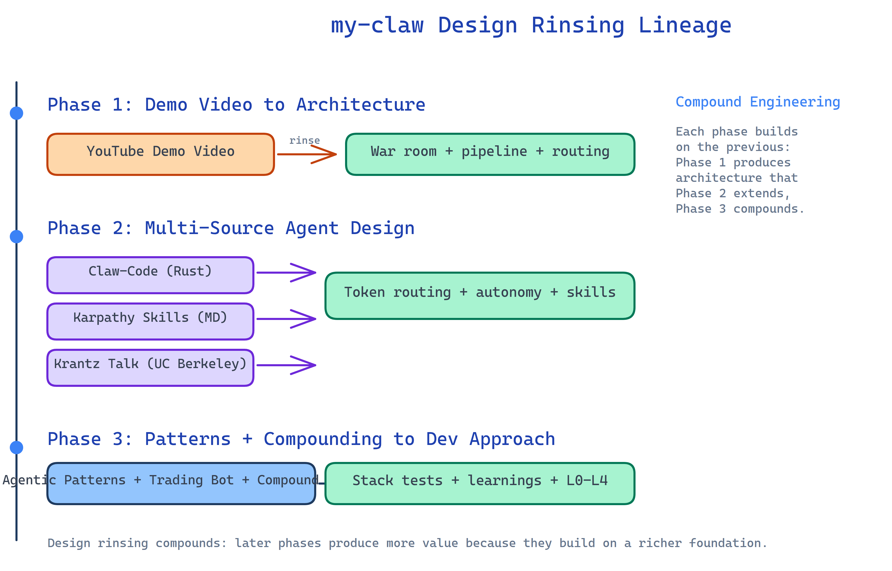
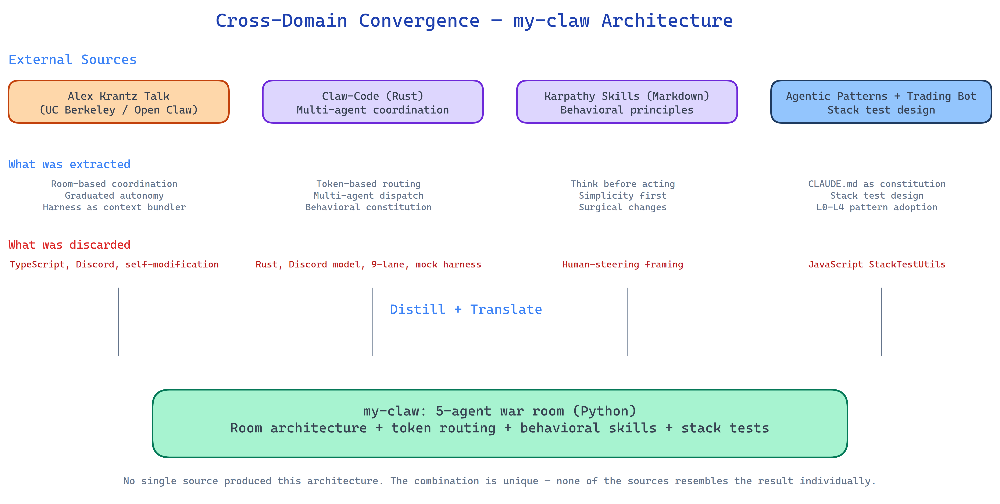

# Reference my-claw Project — Design Rinsing in Practice

**Project:** my-claw — Autonomous, self-managing, multi-agent AI system with voice, Telegram, Discord, and WebSocket interfaces

**Tech Stack:** Python 3.11+, Pipecat (real-time frame-processing pipeline), litellm (provider-agnostic LLM gateway), FastAPI, SQLite

**Scale:** 5-agent architecture with 3-tier routing, voice integration via Deepgram STT + Cartesia TTS, 32 test files with 492 test functions (unit + stack + Docker stack + browser stack + Discord stack), room-based isolation with 3 templates, 10 worker roles, behavioral constitution, trust tiers, memory system, heartbeat, and scheduling

This case study demonstrates design rinsing — the structured practice of extracting distilled architectural understanding from external sources and translating it into a project's design. The my-claw project evolved through three distinct rinsing phases, each building on the last. That compounding — where each rinsing phase leveraged and extended the previous — is itself an example of [compound engineering](https://github.com/EveryInc/compound-engineering-plugin): each unit of work making subsequent units easier.

---

## The Design Rinsing Lineage



### Phase 1: Transcript to Architecture

The genesis of my-claw was design rinsing a YouTube transcript into working architecture. The video ["I replaced OpenClaw and Hermes with Claude Code agents"](https://www.youtube.com/watch?v=rVzGu5OYYS0) demonstrates a complete multi-agent command center built on the Claude Code Agent SDK — a war room with specialist agents, voice interaction, Telegram interface, and a mission control dashboard.

**Condensed summary of the source material:** The video walks through a system where five agents (Main, Comms, Content, Ops, Research) coordinate through a central dashboard and Telegram. The architecture uses the Claude Code Agent SDK as the bridge to remote terminal sessions, with a queuing system to serialize messages to each agent. Pipecat manages the voice pipeline — labeling conversation "envelopes" and routing them to the right destination. Routing follows three rules: broadcast keywords (team-wide requests), agent name prefixes (explicit targeting), and smart auto-assignment via a cheap language model. A "hive mind" provides unified memory state across agents. The memory system layers pinned memories (persistent), Gemini-classified insights (preferences, facts), and decaying memories. Security uses chat ID allow lists and pin-based authentication.

**What was extracted:**

- Room-based agent coordination — the "war room" metaphor with 5 specialist agents (Main, Comms, Content, Ops, Research)
- Frame-processing pipeline — Pipecat's envelope/frame metaphor as the communication substrate
- 3-tier routing — broadcast keywords, agent name prefix, smart auto-assignment (translated into token scoring)
- Hive mind memory — unified memory state accessible to all agents (translated into SQLite-backed MemoryManager)
- Multiple interfaces — voice (Deepgram + Cartesia), Telegram, and dashboard from day one
- Queuing model — serialized message processing per agent to prevent race conditions

**What was discarded:**

- The Agent SDK bridge itself (my-claw uses litellm directly for LLM calls)
- The specific Gemini-based memory classification (my-claw uses typed learning categories: pattern, pitfall, preference, architecture, operational)
- The Cloudflare tunnel for dashboard access (my-claw runs localhost-only by default)
- The Obsidian injection system (my-claw uses its own identity/soul system)

### Phase 2: Multi-Source Rinsing for Agent Design

With the core architecture established, the second phase rinsed three external sources to evolve my-claw's agent design, autonomy model, and behavioral discipline.

**Alex Krantz — "Principles for Autonomous System Design"** — The [UC Berkeley talk](https://youtu.be/sxX8BMscce0) analyzes autonomous system design through phases of increasing "loopiness" — from single-token prediction, to multi-turn conversation, to scoped agents with static orchestration, to fully autonomous agents with dynamic tool discovery. The key architectural insight: all these systems boil down to LLM calls; the only difference is the context provided. A "harness" is fundamentally a package that bundles context and ensures the LLM has what it needs.

From this talk, my-claw extracted:

- **Graduated autonomy** — the matryoshka-doll model of nested autonomy loops translated into trust tiers: advisory (requires approval), supervised (logs but proceeds), autonomous (no oversight). Auto-promotion after consecutive successes, auto-demotion after failures. Persisted in `trust_scores` table.
- **Harness as context bundler** — agent system prompts bundle identity, skills, memory, project context. The prompt injection order in `LiteLLMAgentProcessor` (role → soul → user → project → skills) directly implements this principle.
- **Closed-loop control** — agents view results of actions and decide next actions, not fire-and-forget

What was not copied: Open Claw's specific implementation (TypeScript, Discord interface), self-modification capabilities, the specific tool surface.

**Claw-Code (Rust)** — The [ultraworkers/claw-code](https://github.com/ultraworkers/claw-code) project is a Rust multi-agent coding coordination system with three-part architecture: OmX (workflow layer), clawhip (event router), and OmO (multi-agent coordination with planning, handoffs, and verification loops). From claw-code, my-claw extracted:

- **Token-based routing** — Claw-Code's approach to routing work via token scoring translated directly into my-claw's `RouterProcessor` with `responsibility_tokens` — each agent declares keywords describing its domain, and the router scores incoming requests against those tokens.
- **Multi-agent coordination** — Claw-Code's role-based dispatch influenced my-claw's 5-agent architecture with the 3-tier router (broadcast → name prefix → token scoring → fallback).
- **Behavioral constitution** — Claw-Code's approach to constraining agents through directives influenced my-claw's `skills/` directory where behavioral guidelines are loaded into agent system prompts at runtime.

What was not copied: Claw-Code's Rust implementation, its Discord-driven coordination model, its 9-lane development approach, its mock parity harness.

**Andrej Karpathy's LLM Coding Principles (Markdown)** — The [andrej-karpathy-skills](https://github.com/forrestchang/andrej-karpathy-skills) project codifies Karpathy's observations about LLM coding pitfalls into four behavioral principles. My-claw adapted all four as runtime-injected agent skills:

| Karpathy Skill | my-claw Adaptation | Translation |
|---|---|---|
| Think Before Coding | `think-before-acting.md` | Extended with trust-tier awareness: applies especially at advisory/supervised tiers; at autonomous tier, act first but note reasoning |
| Simplicity First | `simplicity-first.md` | Nearly identical, trimmed for runtime context injection |
| Surgical Changes | `surgical-execution.md` | Nearly identical, trimmed for runtime context injection |
| Goal-Driven Execution | `goal-driven.md` | Nearly identical, trimmed for runtime context injection |

The key translation: Karpathy's principles were originally designed for a human steering an LLM coding assistant. In my-claw, they are injected into **autonomous agents' system prompts at runtime** — the agents self-regulate using these principles. The trust-tier addition in `think-before-acting.md` connects behavioral guidelines to my-claw's graduated autonomy system (advisory/supervised/autonomous), a my-claw-specific adaptation.

### Phase 3: Agentic Patterns + Compound Engineering Infusion

The third phase rinsed the agentic-patterns repository, the reference trading bot's codebase, and the compound-engineering plugin to establish my-claw's development approach and compounding practices.

**From agentic-patterns docs:** L0-L4 patterns were rinsed to shape how my-claw structures its own development:

- **L0 Foundation**: CLAUDE.md as constitution (my-claw adopted a 91-line CLAUDE.md with project structure, key concepts, and testing guidance), deep modules (each subsystem is a self-contained module with clear interface), progressive disclosure (docs/architecture.md for detailed reference, docs/guides/ for operational guides)

- **L1 Closed Loop Design**: Stack tests adopted directly — my-claw has 12 stack tests (ST1-ST12), 5 tool stack tests, 4 room stack tests, 11 Docker stack tests (ST-D1-ST-D11), and 8 browser stack tests (ST-B1-ST-B8), all hitting real services with zero mocks

- **L2 Behavioral Guardrails**: Skills overlay pattern adopted — my-claw's `skills/` directory follows the same overlay architecture described in L2 Pattern 2.1. Constitutional rules govern agent behavior at runtime.

**From the trading bot reference project:** The stack test design was the primary extraction — StackTestUtils pattern, sequential test ordering, health endpoint test mode, test fixture bootstrapping. The specific testing infrastructure wasn't copied (different language, different framework) but the testing philosophy translated: real dependencies, full-loop assertions, sequential ordering, atomic user journeys.

**From the compound-engineering plugin:** The compounding principle — each unit of engineering work should make subsequent units easier — shaped my-claw's memory system and development practices:

- **Per-project learnings** — `MemoryManager` stores typed learnings (pattern, pitfall, preference, architecture, operational) in SQLite. `get_project_context()` injects recent learnings into agent system prompts, so agents start from a higher knowledge baseline each session.
- **Identity system** — `IdentityManager` manages `user.md` and `soul.md`, providing persistent user context that compounds across sessions.
- **Plan-driven development** — my-claw's `docs/plans/` directory contains numbered implementation plans with task tracking. Plans are archived when complete (version control preserves history), following the agentic-patterns principle of deleting stale docs rather than archiving them.

---

## my-claw Architecture (Rinsed Design)



The resulting architecture shows clear lineage from each rinsing phase:

```
User Input (voice/text/telegram/discord)
    ↓
[Transports: Dashboard WebSocket / Telegram / Discord / AndonCord]
    ↓
RoomManager → isolated pipelines per room                                    ← rooms system
    ↓
RouterProcessor (3-tier: broadcast → @prefix → token scoring → fallback)    ← from claw-code
    ↓
ResponseMultiplexer → routes to registered transports
    ↓
[Agent × 5: main, comms, content, ops, research]                           ← from genesis video
    ↓                                                                         + behavioral skills from karpathy
    ↓                                                                         + trust tiers from Krantz talk
    ↓                                                                         + worker delegation via tools
User receives response (+ audio via Cartesia TTS if enabled)
```

**Frame processing pipeline** (from Pipecat, conceptually rinsed from the genesis video's envelope metaphor):

```python
# Custom frames for inter-agent communication
@dataclass
class AgentTextFrame(TextFrame):
    target_agent: str = ""
    original_transcription: str = ""
    request_id: str = ""
    room_id: str = ""

@dataclass
class RoutingDecisionFrame(Frame):
    targets: list[str] = field(default_factory=list)
    method: str = ""  # "broadcast" | "prefix" | "auto" | "fallback"
```

**Token-based routing** (from claw-code):

```python
def route_text(text: str, agents: dict[str, str]) -> tuple[list[str], str]:
    # Tier 1: broadcast keywords
    if tokens & BROADCAST_KEYWORDS:
        return list(agents.keys()), "broadcast"
    # Tier 2: name prefix
    for prefix in AGENT_PREFIXES:
        if lower.startswith(prefix):
            return [prefix[1:]], "prefix"
    # Tier 3: token scoring (from claw-code's responsibility_tokens)
    for name, responsibility in agents.items():
        s = score_tokens(text, responsibility)
        if s > best_score:
            best_score = s
            best_agent = name
    # Fallback: main agent (triage)
    return ["main"], "fallback"
```

**Graduated autonomy** (from Krantz talk's matryoshka model):

Trust tiers — advisory (requires approval), supervised (logs but proceeds), autonomous (no oversight) — with auto-promotion after consecutive successes and auto-demotion after failures. Persisted in `trust_scores` table.

**Rooms** (evolved beyond initial sources):

Three templates for different collaboration patterns: `pod` (3 agents, focused work), `war_room` (all 5 agents, permanent coordination), `tiger_team` (3 agents, transient incident response). Each room gets its own isolated pipeline with dedicated Router, Multiplexer, Agent subset, Session, and ToolRegistry.

**Tool system with delegation**:

`ToolRegistry` with dynamic registration and context injection. 5 built-in tools (read, write, bash, grep, glob) plus a `delegate` tool that spawns worker roles (staff_engineer, debugger, qa_lead, etc.) via litellm — persona prompts for delegation, not separate pipeline agents.

**Memory system** (from compound engineering principles):

`MemoryManager` stores typed learnings per project. `IdentityManager` provides persistent user context. Prompt injection order: role → soul → user → project → skills. Each session starts from a higher knowledge baseline because prior learnings are injected automatically.

---

## Testing (from Trading Bot + Agentic Patterns)

The testing infrastructure demonstrates rinsing at the practice level — the trading bot's stack test philosophy translated to Python:

| Trading Bot Pattern | my-claw Translation |
|---|---|
| StackTestUtils class | Per-test session management with real services |
| Sequential test ordering | ST1-ST11 ordered by dependency (startup → routing → voice → rooms → tools → trust → heartbeat) |
| Real dependencies | Zero mocks in integration tests; real Deepgram, Cartesia, litellm APIs |
| Full-loop assertions | Tests verify entire user journeys, not individual functions |
| Docker stack tests | ST-D1-ST-D10 against Docker container |
| Browser stack tests | ST-B1-ST-B8 via Playwright against running container |
| Discord stack tests | ST-DS1-ST-DS6 against real Discord bot |
| Health endpoint test mode | Container readiness checks before domain tests |
| Room isolation tests | ST-R1-ST-R4 verifying isolated pipelines don't interfere |
| Tool stack tests | ST-T1-ST-T6 verifying delegation and tool execution with real LLM |

Test markers: `pytest -m "not integration"` for unit (no network), `pytest -m integration` for real API tests (auto-skip if no .env). Unit tests use no mocks — they test against the module interfaces directly.

---

## Cross-Level Integration

**How Phase 1 enables Phase 2:** The concrete architecture from the genesis video — 5-agent war room, Pipecat pipeline, 3-tier routing — created the structure where the Krantz talk's philosophical principles (graduated autonomy, context bundling) and claw-code's coordination patterns (token scoring, behavioral constitution) could be applied. Without the war room metaphor, token-based routing and trust tiers have no home.

**How Phase 2 enables Phase 3:** The behavioral skills from karpathy and the autonomy model from the Krantz talk gave agents internal discipline, which made agentic-patterns' guardrail concepts and compound engineering's knowledge compounding directly applicable. Skills that agents self-regulate with map to L2's skill overlay pattern; the memory system maps to L2 Pattern 2.8's compounding principle.

**How each phase compounds:** Phase 1 produced architecture. Phase 2 produced agent design and autonomy that fits that architecture. Phase 3 produced development practices and compounding systems that sustain both. Each phase builds on the extracted patterns of the previous, not replacing them but extending — the definition of compound engineering applied to design rinsing.

---

## Key Takeaways

1. **Design rinsing extracts patterns, not code** — Every rinse produced adaptation, not copying. The genesis video's war room became a Python Pipecat pipeline. The Krantz talk's matryoshka model became trust tiers with auto-promotion. The Rust token-scoring system became Python token-scoring. The Karpathy human-LLM principles became autonomous agent self-regulation. The trading bot's JavaScript StackTestUtils became Python integration testing.

2. **Cross-domain sources produce novel combinations** — No single source produced my-claw's architecture. It emerged from rinsing a YouTube demo video, a Berkeley talk on autonomous systems, a Rust coding framework, a Markdown behavioral specification, a Node.js trading bot, a compound engineering plugin, and this pattern library. The combination is unique to my-claw; none of the sources resembles the result individually.

3. **Unstructured sources are valid rinse targets** — Both YouTube transcripts were highly generative. The genesis video produced the concrete architecture; the Krantz talk produced the philosophical framework. Codebases produce specific patterns; transcripts and talks produce mental models. Both are valuable.

4. **Translation is the critical step** — Extraction without translation is just reading. The trust-tier adaptation in `think-before-acting.md`, the Pipecat frame-processing implementation of the envelope metaphor, the MemoryManager implementing compound engineering's learning capture, and the Python testing infrastructure adapted from JavaScript patterns — these translations are where the design value is created.

5. **Design rinsing compounds** — Each phase leveraged the previous phase's extracted patterns. This compounding effect means later rinsing phases produce more value because they build on a richer foundation.

6. **The project evolved beyond its sources** — my-claw now has features no source provided: room-based isolation with templates (pod/war_room/tiger_team), Discord transport with channel-per-room, AndonCord for approval workflows, a tool delegation system with 10 worker roles, heartbeat and scheduling, and an identity system. Design rinsing provides the starting point; the project's own evolution produces capabilities beyond any single source.

---

## References

- ["I replaced OpenClaw and Hermes with Claude Code agents"](https://www.youtube.com/watch?v=rVzGu5OYYS0) — Phase 1 source: concrete architecture (war room, agents, pipeline, routing, interfaces)
- [Alex Krantz — Principles for Autonomous System Design](https://youtu.be/sxX8BMscce0) — Phase 2 source: graduated autonomy, harness as context bundler, closed-loop control
- [Claw-Code](https://github.com/ultraworkers/claw-code) — Phase 2 source: token-based routing, multi-agent coordination, behavioral constitution
- [Andrej Karpathy's LLM Coding Principles](https://github.com/forrestchang/andrej-karpathy-skills) — Phase 2 source: behavioral specification
- [Agentic Patterns](../L1-feedback-loops.md) — Phase 3 source: this repository
- [Reference Telegram Trading Bot Case Study](reference-telegram-trading-bot-case-study.md) — Phase 3 source: stack test design reference
- [Compound Engineering Plugin](https://github.com/EveryInc/compound-engineering-plugin) — Phase 3 source: compounding knowledge, per-project learnings, plan-driven development

---

**Previous:** [Reference Telegram Trading Bot Case Study](reference-telegram-trading-bot-case-study.md) | [Back to Overview](../../README.md)
